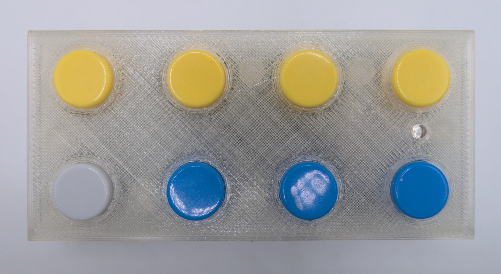
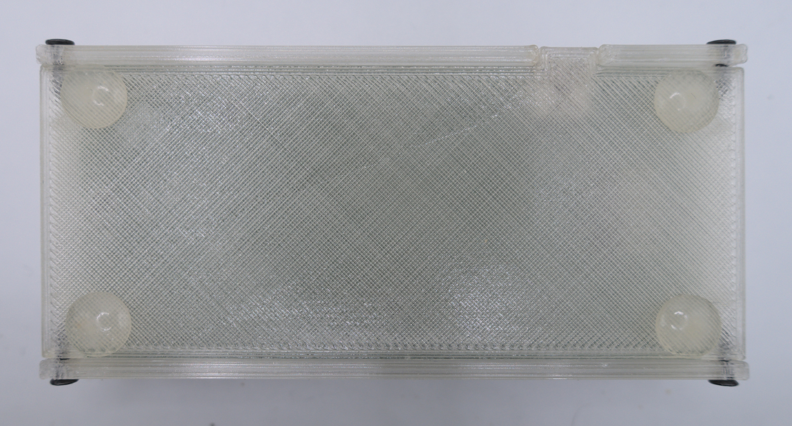
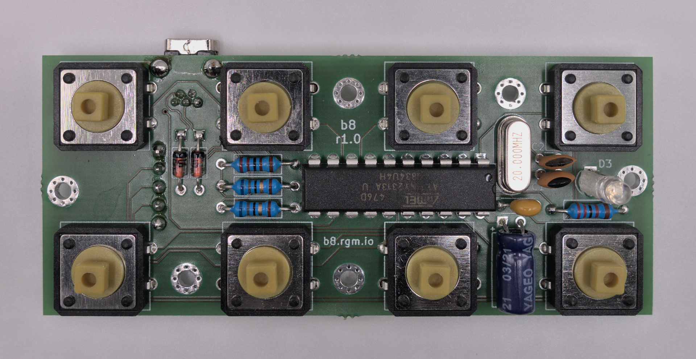
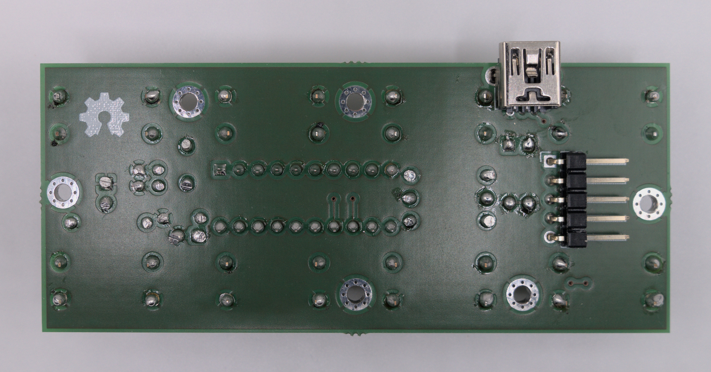

# b8

A simple USB keypad with 8 programmable buttons.

## Motivation

I wanted to have a simple keypad I could use to control my computer.

I wanted to be able to write userspace programs in Golang, that would react to the keypress events in the keypad, and execute some programmed action, instead of building long sequences of keypress macros.

I wanted the PCB to be simple (PTH parts only), to have only the buttons and a single indicator LED, and to use the simplest/smallest microcontroller that could handle USB 1.1 and 8 buttons.

I wanted the enclosure to be 3D-printed at home.

I wanted it to be as USB HID compliant as possible, so I could learn more about it.

## What is included

- [Firmware source code](./firmware/)
- [Golang client library](./go/b8/)
- [Printed Circuit Board (Kicad sources)](./pcb/)
- [3D models for a simple enclosure](./3d-models/)
- [`udev` rules for Linux](./share/udev/)

## Pictures

