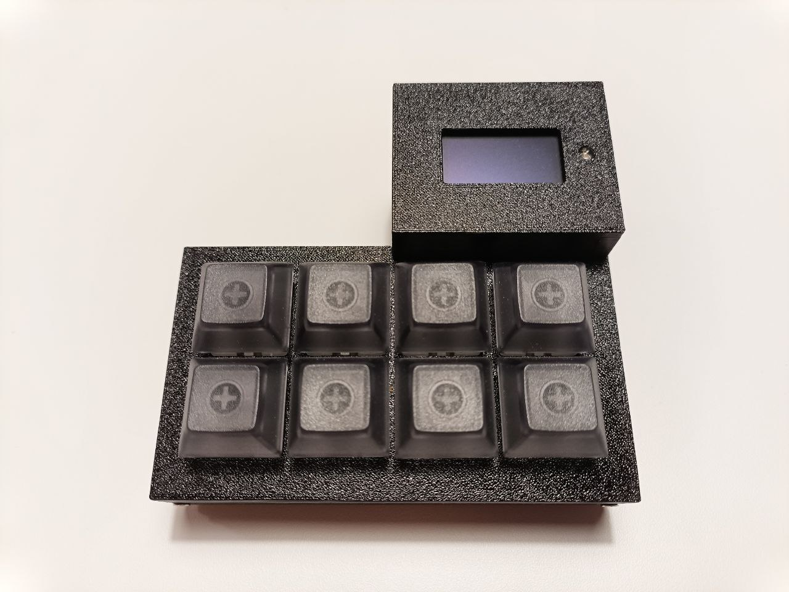

# b8

A simple USB keypad with 8 programmable buttons.


## Motivation / Project requirements

- [x] I want to have a simple keypad I can use to control my computer.
- [x] I want to be able to write userspace programs in Golang, that will react to the keypress events in the keypad and execute some Golang code instead of building long sequences of keypress macros.
- [x] I want the PCB to be simple (PTH parts only), to have only the buttons and a single indicator LED, and to use the simplest/smallest microcontroller that can handle USB 1.1 and 8 buttons, like the [`ATtiny4313`](https://www.microchip.com/en-us/product/attiny4313).
- [x] I want the enclosure to be 3D-printable at home.
- [x] I want the firmware to be as USB HID compliant as possible, so I can learn more about the USB stack and specifications.
- [x] I want the client library to support at least Linux and Windows.

> [!NOTE]
> After using the original [`b8`](#b8) keypad for a few months I realized that having a small OLED screen added to the keypad could be very useful. This new addition required using a more powerful microcontroller (I picked the [`STM32F042K6`](https://www.st.com/en/microcontrollers-microprocessors/stm32f042k6.html), which is not PTH, but still quite easy to hand-solder).
>
> These additions resulted in a new `b8` keypad variant named [`b8-mega`](#b8-mega). This new variant also includes support for 5-pin mechanical keyboard switches instead of the simpler 12mm SPST push-buttons used in the original variant.
>
> The original `b8` keypad variant is still actively used and maintained.


## Variants

> [!TIP]
> The following resources are common to all variants:
>
> - [Golang client library](./go/b8/)
> - [`udev` rules for Linux](./share/udev/)


### b8-mega

- [Firmware source code](./firmware/b8-mega/)
- Printed Circuit Board
  - [Interactive Bill of Materials](https://rafaelmartins.github.io/b8/ibom/b8-mega.html)
  - [Kicad sources](./pcb/b8-mega/)
- [Enclosure 3D models](./3d-models/b8-mega/)




### b8

- [Firmware source code](./firmware/b8/)
- Printed Circuit Board
  - [Interactive Bill of Materials](https://rafaelmartins.github.io/b8/ibom/b8.html)
  - [Kicad sources](./pcb/b8/)
- [Enclosure 3D models](./3d-models/b8/)


### What is included

- [Golang client library](./go/b8/)
- [Printed Circuit Board (Kicad sources)](./pcb/)

- [`udev` rules for Linux](./share/udev/)


## Program examples

### Simple

```go
package main

import (
	"fmt"
	"log"
	"time"

	"github.com/rafaelmartins/b8/go/b8"
)

func main() {
	dev, err := b8.GetDevice("")
	if err != nil {
		log.Fatal(err)
	}

	if err := dev.Open(); err != nil {
		log.Fatal(err)
	}
	defer dev.Close()

	for i := 0; i < 3; i++ {
		dev.Led(b8.LedFlash)
		time.Sleep(100 * time.Millisecond)
	}

	dev.AddHandler(b8.BUTTON_1, func(b *b8.Button) error {
		fmt.Println("pressed")
		duration := b.WaitForRelease()
		fmt.Printf("released. pressed for %s\n", duration)
		return nil
	})

	if err := dev.Listen(nil); err != nil {
		log.Fatal(err)
	}
}
```


## F.A.Q.

### How to implement a more complex client software?

Please check the Golang [API documentation](https://pkg.go.dev/github.com/rafaelmartins/b8/go/b8).

### How to use this keypad to control `OBS`, similarly to what the `Stream Deck` does?

It is possible to write Golang code that interacts with `OBS` by using the `goobs` library: https://github.com/andreykaipov/goobs. This library could be easily integrated with our [Golang client library](./go/b8/).
