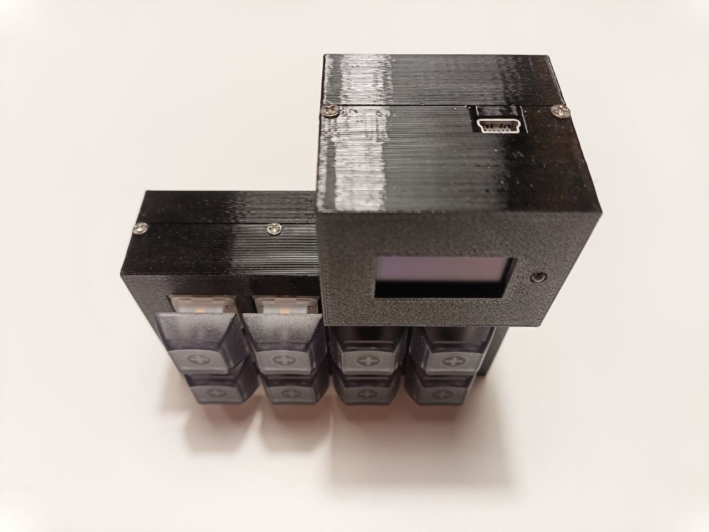
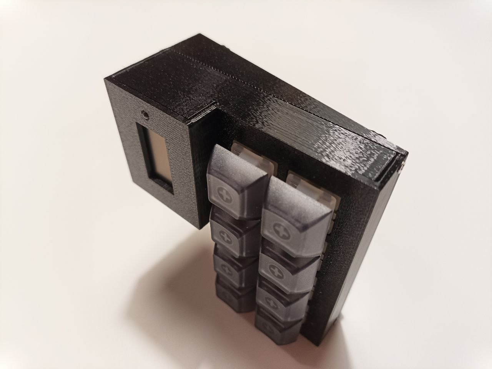
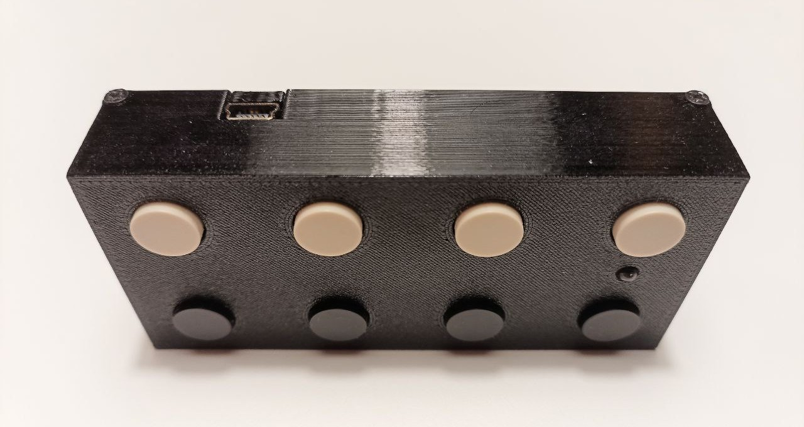

# octokeyz

A simple USB macropad with 8 programmable buttons.


## Requirements/Motivation

- [x] I would like a simple macro pad that I can use to control my computer.
- [x] I would like to be able to write userspace programs in Go that respond to the key press events from the macropad and then execute some Go code, rather than emulating complex key press sequences.
- [x] I would like the PCB to be as simple as possible, with only PTH components, just buttons and a single indicator LED, and the smallest/simplest microcontroller that can handle USB 1.1 and 8 buttons, such as the [`ATtiny4313`](https://www.microchip.com/en-us/product/attiny4313).
- [x] I would like the case to be suitable for 3D printing at home.
- [x] I would like the firmware to be as USB HID compliant as possible, so I can learn more about the USB stack and specifications.
- [x] I would like the client library to support at least Linux and Windows.

> [!NOTE]
> Following several months of use with the initial `octokeyz` macro pad, I recognized that incorporating a tiny OLED display would significantly enhance its functionality. To accomplish this, I chose a more powerful microcontroller, namely the [`STM32F042K6`](https://www.st.com/en/microcontrollers-microprocessors/stm32f042k6.html)/[`STM32F042K4`](https://www.st.com/en/microcontrollers-microprocessors/stm32f042k4.html), although it's not a PTH part, it can be easily hand-soldered.
>
> The introduction of these enhancements led to the creation of an updated version of the `octokeyz` macro pad, dubbed `octokeyz-mega`. This revised model boasts compatibility with more advanced 5-pin mechanical keyboard switches, rather than the simpler 12mm SPST push-button design found in the initial iteration.
>
> Given the low cost of STM32 microcontrollers today, and for the sake of simplifying maintenance, I converted the original `octokeyz` variant to also use the [`STM32F042K6`](https://www.st.com/en/microcontrollers-microprocessors/stm32f042k6.html)/[`STM32F042K4`](https://www.st.com/en/microcontrollers-microprocessors/stm32f042k4.html) parts. This allows us to use a single DFU-compatible firmware across all board variants, simplifying the deployment process.


## Variants

> [!TIP]
> The following resources are shared among all the variants:
>
> - [Source code of the firmware](./firmware/)
> - [Go client library](./go/octokeyz/)
> - [`udev` rules for Linux](./share/udev/)


### octokeyz-mega

- [Schematics](./pcb/octokeyz-mega/octokeyz-mega.pdf)
- [Interactive Bill of Materials](https://rafaelmartins.github.io/octokeyz/ibom/octokeyz-mega.html)
- [Kicad files](./pcb/octokeyz-mega/)
- [Enclosure 3D models](./3d-models/octokeyz-mega/)






### octokeyz

- [Schematics](./pcb/octokeyz/octokeyz.pdf)
- [Interactive Bill of Materials](https://rafaelmartins.github.io/octokeyz/ibom/octokeyz.html)
- [Kicad files](./pcb/octokeyz/)
- [Enclosure 3D models](./3d-models/octokeyz/)





## Program examples

### Simple

```go
package main

import (
	"fmt"
	"log"
	"time"

	"rafaelmartins.com/p/octokeyz/go/octokeyz"
)

func main() {
	dev, err := octokeyz.GetDevice("")
	if err != nil {
		log.Fatal(err)
	}

	if err := dev.Open(); err != nil {
		log.Fatal(err)
	}
	defer dev.Close()

	for i := 0; i < 3; i++ {
		dev.Led(octokeyz.LedFlash)
		time.Sleep(100 * time.Millisecond)
	}

	dev.AddHandler(octokeyz.BUTTON_1, func(b *octokeyz.Button) error {
		fmt.Println("pressed")
		duration := b.WaitForRelease()
		fmt.Printf("released. pressed for %s\n", duration)
		return nil
	})

	if err := dev.Listen(nil); err != nil {
		log.Fatal(err)
	}
}
```


## F.A.Q.

### How do we implement more complex client software?

Please check the Go [API documentation](https://pkg.go.dev/rafaelmartins.com/p/octokeyz/go/octokeyz).

### How can I use this macropad to control `OBS` in the same way as the `Stream Deck` does?

You can write Go code that interacts with `OBS` using the `goobs` library, which is available at https://github.com/andreykaipov/goobs. This library can be easily integrated with our [existing Go client library](./go/octokeyz/).
