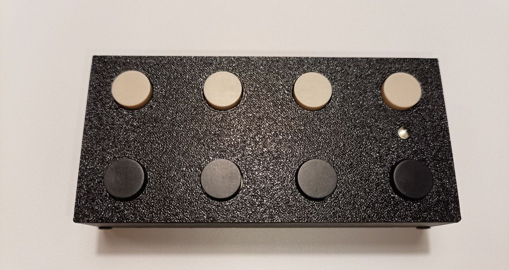

# Hardware variant: octokeyz

The basic variant of the octokeyz macropad, featuring eight 12mm SPST push-buttons and a single indicator LED. It shares a single firmware binary with the [octokeyz-mega](20_octokeyz-mega.md) variant.

## Overview

[octokeyz](10_octokeyz.md), assembled

| Field | Value |
|-------|-------|
| MCU | STM32F042K6 / STM32F042K4 (ARM Cortex-M0, 48 MHz) |
| Buttons | 8x 12mm SPST push-buttons |
| LED | PWM-driven, 5 states (on, flash, slow blink, fast blink, off) |
| Display | None |
| USB | Mini-B, Full-speed, HID class, up to 100 mA |
| USB VID:PID | `1d50:6184` |
| PCB revision | 20240616 |
| License | CERN-OHL-S-2.0 (hardware) / BSD-3-Clause (firmware) |

## PCB

octokeyz PCB, top side

octokeyz PCB, bottom side

**Resources:**

- [Schematic (PDF)](@@/p/octokeyz/kicad/octokeyz_20240616_sch.pdf)
- [Interactive BOM](@@/p/octokeyz/kicad/octokeyz_20240616_ibom.html)
- [Gerber files (ZIP)](@@/p/octokeyz/kicad/octokeyz_20240616_gerber.zip)

KiCad 9.0+ source files are available in the repository under `pcb/octokeyz/`.

## Enclosure

3D-printable enclosure designed in OpenSCAD, consisting of three parts:

| Part | File |
|------|------|
| Front shell | `enclosure-front.stl` |
| Back cover | `enclosure-back.stl` |
| LED holder | `led-holder.stl` |

OpenSCAD source files are in the repository under `3d-models/octokeyz/`, with shared modules in `3d-models/lib/`.

## Display

This variant does not include a display. The firmware detects display absence at runtime and operates normally without one. For the display-equipped variant, see [octokeyz-mega](20_octokeyz-mega.md).

## Build manual

The board uses predominantly through-hole components, with SMD parts limited to the microcontroller and the USB ESD protector. The LED holder is a 3D-printed part that holds the LED, so that it clips into the front enclosure opening.

For the full assembly procedure, see my generic [Hardware Build Manual](@@/hardware/build-manual/).

- For firmware flashing instructions, see [Firmware](30_firmware.md).
- For writing programs to interact with the device, see [Client libraries](40_client-libraries.md).
